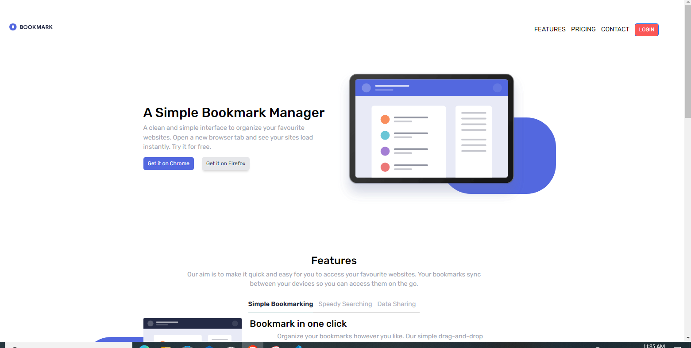

# Frontend Mentor - Bookmark landing page solution

This is a solution to the [Bookmark landing page challenge on Frontend Mentor](https://www.frontendmentor.io/challenges/bookmark-landing-page-5d0b588a9edda32581d29158). Frontend Mentor challenges help you improve your coding skills by building realistic projects. 

## Table of contents

- [Overview](#overview)
  - [The challenge](#the-challenge)
  - [Screenshot](#screenshot)
  - [Links](#links)
- [My process](#my-process)
  - [Built with](#built-with)
  - [What I learned](#what-i-learned)
  - [Continued development](#continued-development)
  - [Useful resources](#useful-resources)
- [Author](#author)

## Overview

### The challenge

Users should be able to:

- View the optimal layout for the site depending on their device's screen size
- See hover states for all interactive elements on the page
- Receive an error message when the newsletter form is submitted if:
  - The input field is empty
  - The email address is not formatted correctly

### Screenshot



### Links

- Solution URL: [Github]()
- Live Site URL: [Live Github]()

## My process

### Built with

- Semantic HTML5 markup
- Sass/SCSS
- Bootstrap
- jQuery/Javascript
- Mobile-first workflow


### What I learned
  
  -I could reuse code from another project , my junior project insure landing page master , for adding the hamburger menu.
  -I could use Bootstrap tabs for the tabs section (see link)
  -I got rid of the unnesscary scss folder and custom file for breakpoints. I thought for the screenshot in the profile at frontendmentor the sizes had to be either 375px and 1440px
  - for the responsive pill shaped blue background , I had to use padding and :before(see link) 
    and % for the size/position(see another link)
  - back to using BEM naming
  - I had different html (see below), for the tabs first , with an added div for the d-flex and without the inner row/col as in the top shape divs, so it didn't have the same widths and I could not understand why not. 
  ```
     <div class="col tab-content " >
                        <div class="tab-pane fade show active " id="underline-bookmark" role="tabpanel" aria-labelledby="underline-bookmark-tab" tabindex="0">
                            <div class="d-flex flex-md-row flex-column ">
                                <div class="order-last ">
                                    <h3>Bookmark in one click</h3>
                                    <p>Organize your bookmarks however you like. Our simple drag-and-drop interface 
                                    gives you complete control over how you manage your favourite sites.</p>
                                    <button type='button'>More Info</button>
                                </div>
                                <div class="order-first relativeouter ">
                                    <div class="shape transform-left-down"></div>
                                    
                                </div>
                            </div>
                        </div>
      </div>
  ```


### Continued development

- Daily tutorials and projects in HTML5, CSS3, Javascript, Bootstrap, Sass/SCSS. For now, in time I will go re-learn React ect.

### Useful resources


## Author

- Website - [One of my latest codepens](https://codepen.io/cynthiab72/pen/oNybYON)
- Frontend Mentor - [@cmb347827](https://www.frontendmentor.io/profile/cmb347827)

